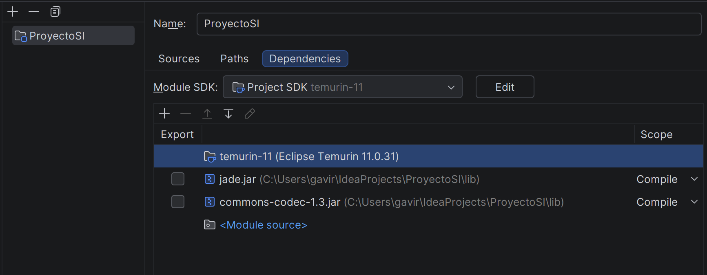

# Sistema planificador de estudios para exámenes

>[!NOTE]
>Presentacion del Proyecto:
>[Planificador de estudios](.PresentacionSI.pdf) 

## Descripción del Proyecto

Este programa actúa como un asistente automatizado que genera planes de estudio personalizados para ayudar a un estudiante a organizar la preparación de sus exámenes.

El flujo de uso del sistema es el siguiente:

- **1. Entrada de datos:** A través de una interfaz gráfica se introduce la información básica de sus próximos exámenes (Asignatura, Créditos, Porcentaje del examen, Dificultad, Días antes del examen, Nota deseada).

- **2. Análisis Inteligente:** El sistema evalúa estos datos para calcular dos métricas clave por cada asignatura: el esfuerzo necesario (horas de estudio recomendadas) y el nivel de urgencia (prioridad del examen).

- **3. Resultados:** El programa muestra un plan de estudio por cada Asignatura en una ventana emergente.


## Integrantes del Grupo

- Andrés Chamoso Rodríguez
- Yoan Crul
- Aaron Suarez 
- Andres David Gaviria Salcedo 
- Vicent Morant Boigues 

---

# 1. Instrucciones de Instalación

## Git y Requisitos
Para preparar el entorno de desarrollo y colaborar en este proyecto, sigue estos pasos:

1. **Clonar el repositorio:**
```bash
   git clone https://github.com/elencantabuelas/ProyectoSI
````
o puedes usar github desktop

2. **Requisitos previos:**
    
    - Java Development Kit 11 recomendado
    - Plataforma JADE descargada.
        
3. **Configuración en el IDE (IntelliJ IDEA / Eclipse):**
    
    - Importar el proyecto como aplicación Java.
    - Añadir los ficheros `jade.jar` y `commons-codec.jar` al _classpath_ del módulo 


# 2. Dependencias Necesarias



# 3. Instrucciones de Ejecución

Para ejecutar el sistema planificador de estudios, sigue estos sencillos pasos:

1.  **Abre el Proyecto:** Abre el proyecto en tu entorno de desarrollo (por ejemplo, IntelliJ IDEA).

2.  **Localiza el Punto de Entrada:** Navega hasta el archivo `Main.java` que se encuentra en el directorio `src`.

3.  **Ejecuta el `main`:** Haz clic derecho sobre el archivo `Main.java` y selecciona la opción **"Run 'Main.main()'"**.

4.  **Inicio de la Aplicación:** Al ejecutar el `main`, ocurrirán dos cosas:
   *   Se abrirá la **consola de JADE (RMA)**, donde podrás ver a todos los agentes del sistema (`coordinador`, `interfaz`, `esfuerzo`, etc.) en estado activo.
   *   Aparecerá la **primera ventana emergente** de la aplicación, preguntándote cuántos exámenes deseas introducir.


# 4. Datos de Ejemplo

Numero de exámenes: 2

#### EXAMEN 1

Asignatura: PPS 

Créditos: 6

Porcentaje del examen: 45

Dificultad (1 - 10): 7

Días antes del examen: 15

Nota deseada: 6

#### EXAMEN 2

Asignatura: Ingenieria de Software I

Créditos: 3

Porcentaje del examen: 6

Dificultad (1 - 10): 5

Días antes del examen: 4

Nota deseada: 7

# 5. Arquitectura del Sistema


```mermaid

---
config:
  layout: elk
  theme: dark
---
flowchart TB
    A["`**Agente Interfaz**`"] -- Lista Examenes --> B["`**Agente Coordinador**`"]
    B -- n°examenes<br>asignatura<br>nota deseada<br>creditos<br>dificultad --> C["`**Agente Esfuerzo**`"]
    B -- n°examenes<br>asignatura<br>nota deseada<br>dias antes del examen --> D["`**Agente Urgencia**`"]
    C -- {numero de examenes} {asignatura, horas} --> E["Agente Ensamblador"]
    D -- {asignatura, prioridad,dias restantes, nota deseada} --> E

     A:::interfaz
     B:::coordinador
     C:::esfuerzo
     D:::urgencia
     E:::ensamblador
    classDef interfaz stroke:#818cf8,fill:#eef2ff
    classDef coordinador stroke:#a78bfa,fill:#f5f3ff
    classDef esfuerzo stroke:#2dd4bf,fill:#f0fdfa
    classDef urgencia stroke:#fb923c,fill:#fff7ed
    classDef ensamblador stroke:#4ade80,fill:#f0fdf4
    style A fill:#000000,stroke:#ffffff,color:#ffffff
    style B color:#ffffff,fill:#000000,stroke:#ffffff
    style C stroke:#ffffff,fill:#000000,font-size:14px,color:#ffffff
    style D fill:#000000,stroke:#ffffff,color:#ffffff
    style E stroke:#ffffff,color:#ffffff,fill:#000000

`````
# 6. Declaración de IA

Durante el desarrollo del proyecto hemos utilizado herramientas de IA generativa como apoyo en la comprensión de conceptos, resolución de dudas puntuales y revisión de código. En todo momento el diseño de la arquitectura, las decisiones técnicas y la implementación final han sido responsabilidad del equipo.

